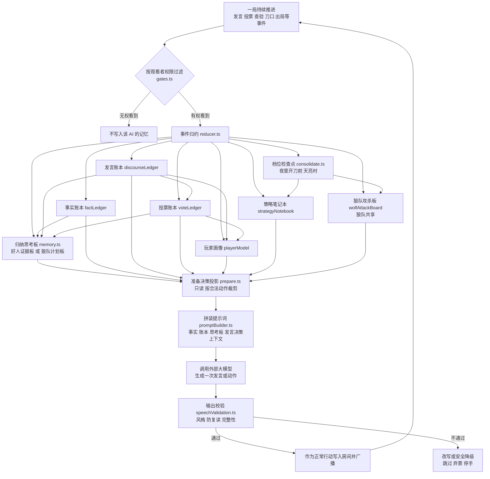
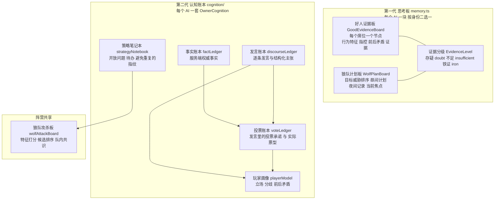

# AI 玩家的"思考"：思路与实现

这篇说明想回答一个问题：轮到一个 AI 玩家行动时，它是怎么从"场上发生了一堆事"走到"开口说一句话"或者"投出一票"的。

先说结论：我们没有让 AI 记住一段"最近发生了什么"的流水账，而是把记忆拆成了几类**结构化的板子和账本**——按阵营分、按事实/发言/投票分账，再在需要发言时临时归纳成一次提示。这样做的原因和具体实现，下面分开讲。

> 说明：AI 能力依赖外部大模型服务，需要使用者自备 API key；项目也没有经过完整、长期的测试。文中只描述代码里已经落下的结构，不预测实际对局效果。

---

## 一、设计思路（我们是怎么想的）

### 1. 为什么不记"一句话总结"，而是记"证据板 / 计划板"

最省事的做法是每轮结束后让模型写一句"当前局势：我觉得 3 号像狼"，存下来，下轮接着用。我们没这么做，原因有几个：

- **一句话会把"事实"和"猜测"揉在一起。** 狼人杀里最要紧的区分是"服务端确认的事实"和"某个玩家的说法"。如果统一压成一句总结，过几轮之后就分不清哪句是查验结果、哪句是谁的发言、哪句是自己的推断了。
- **一句话没法回答"这个判断的依据是什么"。** 玩家追问时，AI 需要说得清"我为什么怀疑他"。如果记忆里只留了结论，AI 就只能反复换着花样复述结论。
- **一句话容易把不同对象混在一起。** 场上通常同时有好几个可疑的人，每个人的可疑程度和依据都不一样，压成一句就丢失了对象维度。

所以记忆板是按**对象（每个席位一个节点）**组织的：每个玩家单独记它的行为、别人对他的指控、他前后有没有矛盾、有哪些证据。发言时再看具体要聊谁，取对应节点。

阵营不同，关心的东西也不一样，于是分成两块板：

- **好人证据板 `GoodEvidenceBoard`**：目标是找狼。记的是"谁在怀疑谁、理由是什么、有没有前后不一致"。
- **狼队计划板 `WolfPlanBoard`**：目标是破局（刀谁、怎么带票），不是找狼。记的是"谁威胁大、谁可能带神、今晚刀谁、明天怎么施压"。

这两块板不会同时给同一个 AI：一个是好人就是证据板，一个是狼就是计划板，由身份决定（见 `server/ai/memory.ts`）。

### 2. 为什么按阵营、按发言/投票/事实分账本

在 `server/ai/cognition/` 里，我们把认知进一步拆成了几本**账**，每个 AI 一套（狼队还有一本共享的攻杀板）。分账的原因是：

- **事实和主张要分开。** `factLedger`（事实账本）只收服务端权威事实，比如"3 号被查验为狼"、"夜里 5 号出局"。带着 `authoritative` 标记，不允许被玩家的话改写。`discourseLedger`（发言账本）收的是"谁说了什么、主张了什么"，标记是 `speaker_claim`——它只是某人的说法，不是事实。两者分开，AI 就不会把别人的话当成已知真相。
- **说过的话和实际怎么投的要分开。** 一个玩家嘴上说"我投 7 号"，最后一票可能投给别人。`voteLedger`（投票账本）把"发言里的投票承诺"和"实际票型"分别记下来，等这一轮结束再对账，才能识别"跳票 / 改票"。如果只记一份，就没法比较"说的"和"做的"。
- **人的画像要单独沉淀。** `playerModel`（玩家画像模型）在主张之上再提炼：谁对谁是什么立场（怀疑 / 信任）、谁和谁意见相反、谁自己前后矛盾。它是从发言/投票账本派生出来的，方便快速回答"这个人整体站哪边"。
- **不同阵营看到的东西本来就不一样。** 好人没有夜间私聊，狼有狼队私聊。账本按 owner 存放，再加上一层可见性闸门（`gates.ts`），从源头上保证狼的夜间信息不会进好人的账本。

一句话说：**分账是为了让"这句话能不能当证据"这件事有明确答案。**

### 3. 证据为什么分三级

证据分级 `EvidenceLevel` 就三档（`memory.ts`）：

- `doubt`（存疑）：只是感觉、没有硬依据的怀疑；
- `insufficient`（不足）：有公开行为支持，但还不够定死，比如票型、改票、逻辑矛盾；
- `iron`（铁证）：服务端已经确认的事实，典型是预言家自己的查验结果。

分三级不是为了好看，而是为了**约束 AI 别把推测说成事实**。提示词里会要求：用一条历史记录时，要同时说清它现在属于哪一级；`iron` 只能来自服务端注入的私有事实，玩家发言再像也只能是"不足"或"存疑"。这样 AI 在发言里保留了一个可检查的口径。

狼这边用的是另一套打分：攻杀板给每个目标算一个"威胁分"（谁暴露神职、谁信息量大、谁带票、谁有保护风险等），分成 `high / medium / low` 三档优先级，而不是复用好人的证据等级。

---

## 二、实现结构（代码是怎么落的）

AI 认知有两代记忆同时存在，提示词里都会用到：

- **第一代：思考板**，在 `server/ai/memory.ts`。每个玩家一块 `AIMemoryBoard`，按身份是好人证据板或狼队计划板。它用一组关键词和计数规则，从事件里直接归纳行为和证据，格式化成一段文字给模型看。
- **第二代：认知账本**，在 `server/ai/cognition/`。它是一套确定性的"事件归约"系统，把事件拆进各本账，之后只读地投影出一份紧凑的决策上下文。

两代并存是历史演进的结果，目前提示词会把两份都拼进去。

### cognition/ 各模块职责

**入口与状态**

- `index.ts`：对外导出 `consolidate` / `prepare` / `reduce` / `reduceEvents` / `createCognitionState` 等。
- `state.ts`：创建一局认知状态 `CognitionStateV2`。给每个玩家建一套 `OwnerCognition`（含事实、发言、投票、画像、策略五本账），再给狼队建一本共享的 `WolfAttackBoard`。
- `types.ts`：所有数据结构的类型定义，包括账本、攻杀板、投影包 `PreparedMemoryContext` 等。

**事件进来**

- `gates.ts`：可见性闸门和输入校验。
  - `canOwnerSeeEvent`：某个 AI 能不能看到这个事件（公开事件人人可见；私密事件必须在 audience 里；狼队私聊还要求本人是狼）。缺 audience 的私密事件按"看不见"处理，宁可少记不可错记。
  - `canWolfTeamSeeEvent`：狼队共享状态额外要求所有声明的接收者都是狼。
  - `speechAnnotationFromEvent`：只接受和当前发言事件严格绑定、字段合法的结构化发言注解，防止把模型自由文本当成结构化信息。
  - `wolfContributionsFromEvent`：只接受结构化、带取值范围校验的狼队特征贡献，散文一律不收。
- `reducer.ts`：核心的确定性归约器。对每个事件，先过可见性闸门，再依次更新事实/发言/投票/画像/策略账本，并更新狼队攻杀板；事件 ID 会记账，重复事件不会二次应用。它是不可变的（每次产出新状态），方便回放和恢复。
- 各本账：
  - `factLedger.ts`：把游戏开始、天黑天亮、出局、查验、守卫/女巫行动、票型结果、猎人行凶、狼刀锁定等写成权威事实。
  - `discourseLedger.ts`：把每条发言/狼聊登记为 utterance，并把其中结构化主张 `ObservedClaim` 存进账本。
  - `voteLedger.ts`：从发言注解里提取投票承诺，从投票事件里登记真实票型；夜里开始时用 `reconcileVoteCommitments` 对账，标记承诺是"兑现 / 跳票"。
  - `playerModel.ts`：在主张之上推导立场、分歧和自相矛盾。
  - `strategyNotebook.ts`：记录未回答的问题、待办优先级、需要避免重复的计划指纹、最近决策摘要。
  - `wolfAttackBoard.ts`：狼队共享的攻杀板。把线索折算成 10 个特征（信息量、票权、带票影响力、暴露成本、保护/反扑风险等），按权重算分，汇总狼队友的偏好，得出候选排序和队内共识状态。

**定期整理**

- `consolidate.ts`：档位检查点，只在"夜里开刀前"和"天亮时"这类安全点触发，且用 checkpoint ID 保证幂等（重复触发不重复生效）。它会清理已死玩家的策略、对账投票承诺、推进攻杀板的时间窗口并重置当晚共识。

**对外读取**

- `prepare.ts`：只读、确定性的投影。给定某个 AI 和当前合法动作/目标，返回一份 `PreparedMemoryContext`——把该 AI 能看的事实、主张、未完成承诺、矛盾、待办、狼队候选按数量上限挑出来。它不改状态，AI 之间互不影响。

### 决策到发言

1. `contextProjector.ts` 先按观看者视角拿到快照、公开/私有事件、规则、经验、思考板、人设和行动状态。
2. `sessionCoordinator.ts` 在此基础上再调用 `session.prepareAICognition(...)`，把认知账本的只读投影挂到 `preparedMemory` 上，然后交给编排器。
3. `promptBuilder.ts` 把内容拼成提示词，其中包括：
   - `formatAIMemoryBoard(...)`：第一代思考板的文字版；
   - `formatPreparedMemory(...)`：第二代账本的紧凑笔记；
   - `speechDecisionContext.ts` 的发言决策上下文：这一步做什么动作、有哪些候选（报告、回应、澄清、站边、提问、保留、指认、跳过等）、有没有被点名、有没有必须回应的冲突，以及"没有新内容时可以跳过"的判断。
4. 模型返回后，`outputParser.ts` 解析成一条游戏动作（发言、投票、夜间行动等）。
5. `speechValidation.ts` 做输出校验：`speechStyleGate` 查风格，`SpeechGate`（`server/ai/speech/speechGate.ts`）查元信息泄露、复读、句子完整性、超长等。`speech/planGate.ts` 还定义了一套结构化发言计划（`speech-plan.v1`）的校验规则，可以检查行动是否合法、目标是否在合法集里、证据引用是否可见。
6. 校验通过就作为正常行动写进房间状态并广播；不通过就走改写或安全降级。
7. 失败降级在 `orchestrator.ts`：真实模型模式下，模型失败后只允许选跳过、弃票、停手之类的安全动作，**不会代模型编造发言**。

需要如实说明的一点：目前模型返回的仍是"动作 + 文本"这个较老的格式，还不能自己产出一份结构化 `SpeechPlan`。所以上面第 5 步里，结构化计划是服务端按当前决策上下文临时拼出来的兼容计划，主要用来跑渲染层的检查；`planGate` 的完整能力已经写好，但还没有接到模型直出的计划上。

### 死亡与恢复

- 每个 owner 带一个 `deathCutoffSequence`。玩家死亡后，事件序号超过这个点的内容不再进他的记忆，相当于记忆在死亡时冻结，也避免重启后把未来的狼队私聊补进来。
- 认知状态不单独持久化，而是进程启动时从事件流重新归约出来（`rebuildCognitionFromEvents`），保证和事件流一致。

---

## 三、流程图

### 图 A：AI 一局思考流程

### 图 B：记忆与账本结构

---

## 四、局限（如实写）

- **没有跨局长期记忆。** 认知账本在一局结束后不保留，下一局从零开始重建。跨局留下的只有另一套单独的"经验库 / 复盘观察"机制，和这里的账本不是一回事，也不在这里展开。
- **"剧本"式思考没有落到模型侧。** 结构化发言计划（`speech-plan.v1`）和对应的校验规则已经写好，但当前模型输出仍是普通文本，计划由服务端临时兼容生成。也就是说，模型还不能先写一份可校验的"发言剧本"再照着说。
- **证据等级有一部分是启发式的。** 好人思考板里的行为统计和证据分级，依赖关键词与简单的矛盾检测，不是严格的逻辑推理。它能帮助 AI 说得有条理，但不能保证判断正确。
- **两代记忆并存，有重复。** 思考板（`memory.ts`）和认知账本（`cognition/`）都从同一批事件派生，提示词里会同时出现，占用了一部分上下文；这是过渡状态，不是最终形态。
- **受可见性和模型能力限制。** 认知状态本身只做确定性记录和汇总，真正的判断仍由外部大模型做出；模型质量、API 可用性和超时都会直接影响表现。真实模型失败时，系统只做安全降级（跳过、弃票、停手），不会替你编一段发言。
- **尚未完整测试。** 上述流程没有经过完整、长期的对局验证，可能存在未知缺陷，请以实际运行结果为准。

把这些写出来，是希望读者先看清它现在能做到哪一步，再决定要不要参考或继续改。它更接近一个"把结构化记忆和提示词工程拼起来"的样例，而不是一套成熟的 AI 推理方案。
